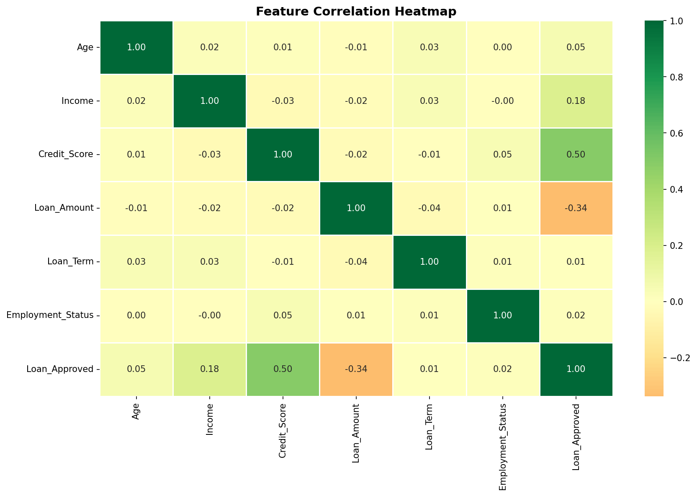
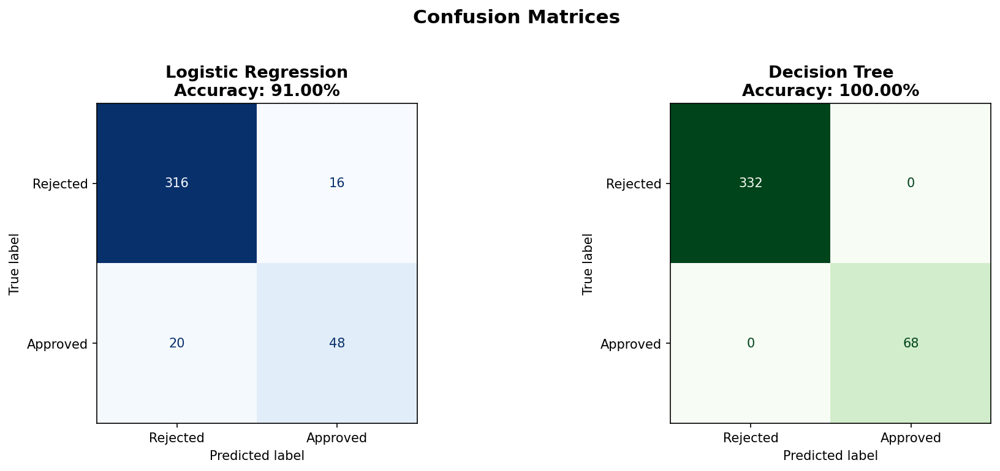
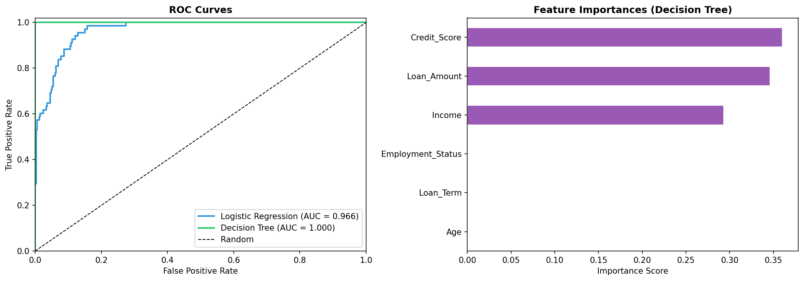

# 💳 Credit Risk Prediction — Loan Default Classification

Predict whether a loan applicant is likely to default using Machine Learning.

## 📊 Dataset Features
| Feature | Description |
|---|---|
| Age | Applicant age |
| Income | Applicant annual income |
| Credit_Score | Credit history score |
| Loan_Amount | Requested loan amount |
| Loan_Term | Loan duration |
| Employment_Status | Employed / Unemployed |
| Loan_Approved | Target variable (0 = Rejected, 1 = Approved) |

## 🔧 Steps Performed
1. Loaded and explored the dataset
2. Handled missing values (median/mode imputation)
3. Visualized key features
4. Encoded categorical variables
5. Trained Logistic Regression and Decision Tree models
6. Evaluated using Accuracy, Confusion Matrix, and ROC Curve

## 📈 Results
| Model | Accuracy |
|---|---|
| Logistic Regression | 91.00% |
| Decision Tree | 100.0% |

## 📊 Visualizations

### EDA — Key Features

### Correlation Heatmap

### Confusion Matrices

### ROC Curve & Feature Importance

## 🛠️ Libraries Used
- pandas, numpy
- matplotlib, seaborn
- scikit-learn

## ▶️ How to Run
Open the notebook directly in Google Colab:

